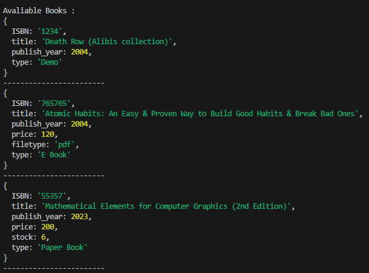
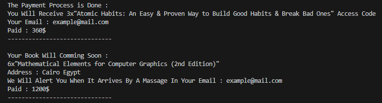
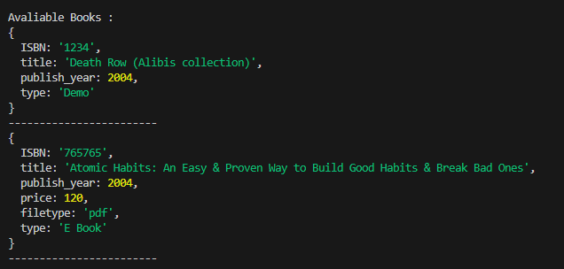

# Fawry Quantum Bookstore
Online Book Store System Provide Adding, Removing, Buying Books

## Installation
1. Clone the repository:
   ```bash
   git clone https://github.com/Ahmed11-coder/fawry_quantum_bookstore.git
   cd fawry_quantum_bookstore
   ```

2. Install dependencies:
   ```bash
   npm install
   # or
   yarn install
   ```

3. Start the development server:
   ```bash
   npm start
   # or
   yarn start
   ```

## Usage

### ( add ) Method :
- To Add Books Pass Arguments As Following : 

  - For Add Demo Book Need Properties :
      - ISBN -> String 
      - Title -> String 
      - Publish Year -> Number

  - For Add Paper Book Need Properties : 
      - ISBN -> String 
      - Title -> String
      - Publish Year -> Number
      - Price -> Number ( > 0 )
      - Stock -> Number ( > 0 )

  - For Add Paper Book Need Properties : 
      - ISBN -> String
      - Title -> String
      - Publish Year -> Number
      - Price -> Number ( > 0 )
      - File-Type -> String

### ( showBooks ) Method :
  - To Display The Avaliable Books

### ( remove ) Method :
  - Remove & Display Also Return The Outdated Books That Passed Specifc Number Of Years ( Default 3 Years)

### ( buy ) Method :
  - To Buy Paper Book Or E-Book

  - To Buy Paper Book Pass The Following Arguments : 
      - ISBN -> String 
      - Quantity -> number
      - Email -> string
      - Address -> string

  - To Buy E-Book Pass The Following Arguments : 
      - ISBN -> String 
      - Quantity -> number
      - Email -> string

## ScreenShots

- Before Payment :


- Payment : 
```typescript
my_inventory.buy('765765', 3, "example@mail.com");
my_inventory.buy('55357', 6, "example@mail.com", "Cairo Egypt");
```


- After Payment :
